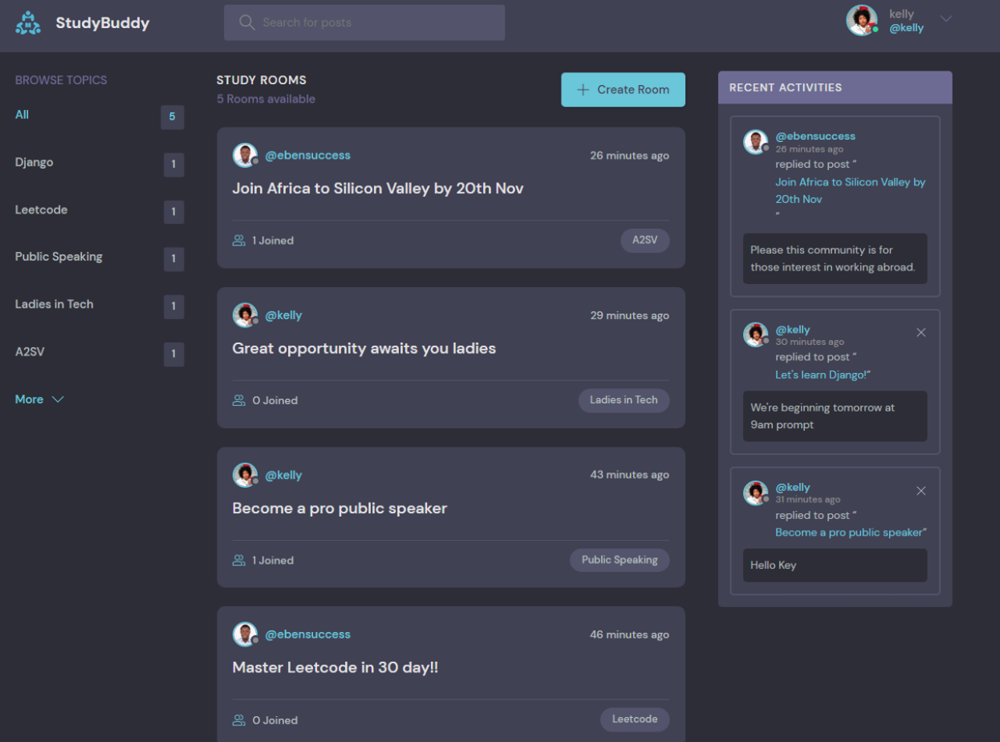
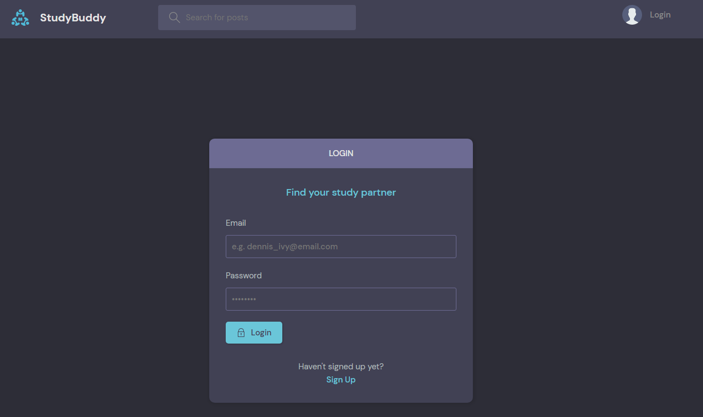
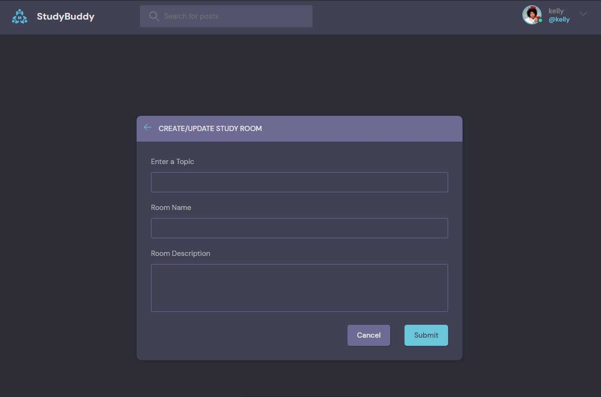

<div align='center'>


# StuddyBuddy

</div>


Study Buddy is a web application that allow users to create an account and log in.

Users are able to get view the participants of a particular topic, they are able to create their own discussion room and add topic of interest. 

<hr>

### Cloning this repository

Clone the repository using the command below:

```bash
git clone  https://github.com/Eben-Success/StuddyBuddy_Django.git
```

Move into the directory where the project files are:
```bash
cd StudyBuddy
```

 Create a virtual environment:
```bash
# Let install virtualenv first
pip install virtualenv

# Then create a virtual environment:
virtualenv envname
```

Activate the virtual environment:
```bash
envname/scripts/activate
```

Install the requirements:
```bash
pip install -r requirements.txt
```

### Running the App

To run the App, use:
```bash
python manage.py runserver
```

### Finally, 
The development server will be started at https://127.0.0.1:8000/

# App Preview:

<div align="center">

### Homepage

</div>



<div align="center">

### Login & Register 

</div>



<div align="center">

### Create Room & Add Topic of Interest

</div>




